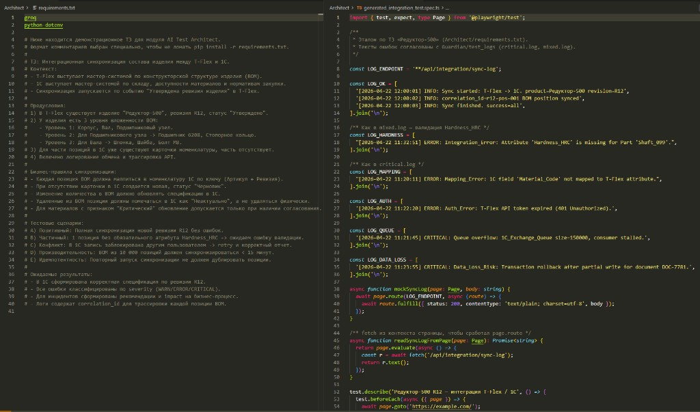

# AI Demo: 1C + T-Flex Automation Assistant

Демо-проект для портфолио по автоматизации связки 1С и T-Flex CAD/PDM.

Статичные материалы (скриншоты, диаграммы) можно складывать в каталог [`assets/`](assets/).

## Модули

- `AI Log Guardian` — анализ логов синхронизации, поиск критических ошибок и рекомендаций.
- `AI Test Architect` — генерация автотестов Playwright на основе технического задания.

### Architect (AI Test Architect)

Связка инженерного ТЗ и результата генерации: [`Architect/requirements.txt`](Architect/requirements.txt) (требования к синхронизации «Редуктор-500») и эталонная спека [`Architect/generated_integration_test.spec.ts`](Architect/generated_integration_test.spec.ts).



*Автоматическая генерация интеграционных сценариев на основе инженерных требований.*

---

### Python 3.11

Интерпретатор **Python 3.11** — основа CLI и скриптов: виртуальное окружение, `pip`, вызовы Guardian (`Guardian/batch_check.py`, `classifier.py`) и Architect (`Architect/test_generator.py`). Зависимости перечислены в [`requirements.txt`](requirements.txt) в корне репозитория.

---

### Playwright

**Playwright** — фреймворк end-to-end тестирования (TypeScript / JavaScript). Architect выдаёт `.spec.ts` с `test.describe`, шагами и проверками `expect`. Для локального прогона сгенерированных тестов установите Node.js и выполните `npm init playwright@latest` в отдельном каталоге или подключите спеку к вашему существующему Playwright-проекту.

---

### Groq Cloud · Llama 3.3

**Groq Cloud** даёт низкую задержку при вызове LLM. В проекте по умолчанию используется модель **`llama-3.3-70b-versatile`** (семейство **Llama 3.3**) для анализа логов и генерации кода тестов. Ключ задаётся в `.env` как `GROQ_API_KEY` (см. [Installation & Quick Start](#installation--quick-start)).

---

## Installation & Quick Start

1. **Клонируйте репозиторий** и перейдите в каталог проекта:

   ```bash
   git clone https://github.com/YOUR_USER/SynAI.git
   cd SynAI
   ```

2. **Скопируйте пример переменных окружения** и вставьте свой API-ключ Groq:

   **Linux / macOS**

   ```bash
   cp .env.example .env
   ```

   **Windows (PowerShell)**

   ```powershell
   Copy-Item .env.example .env
   ```

   Откройте `.env` и укажите значение `GROQ_API_KEY` (ключ из [console.groq.com](https://console.groq.com/)).

   *Без файла `.env`:* можно один раз задать ключ в сессии и сразу запустить Guardian — например, в Bash `export GROQ_API_KEY="ваш_ключ"`, в PowerShell `$env:GROQ_API_KEY="ваш_ключ"`, затем команда из шага 3.

3. **Одна составная команда** — создание виртуального окружения, установка зависимостей и проверка Guardian на демо-логах (выполняйте из корня репозитория, после шага 2):

   **Linux / macOS (Bash):**

   ```bash
   python3.11 -m venv .venv && source .venv/bin/activate && pip install -U pip && pip install -r requirements.txt && python Guardian/batch_check.py
   ```

   **Windows (PowerShell):**

   ```powershell
   py -3.11 -m venv .venv; .\.venv\Scripts\Activate.ps1; pip install -U pip; pip install -r requirements.txt; python Guardian/batch_check.py
   ```

   Если `python3.11` / `py -3.11` недоступны, замените на вашу установленную команду `python`, совместимую с 3.11+.

После успешного прогона отчёты появятся в `Guardian/reports/`. Дополнительно можно сгенерировать Playwright-спеку из ТЗ:

```bash
python Architect/test_generator.py
```

(файл: `Architect/generated_integration_test.spec.ts`).

## Synergy Workflow

1. **ТЗ** — бизнес-требования и сценарии (например, `Architect/requirements.txt` для «Редуктор-500») задают ожидаемое поведение синхронизации T-Flex ↔ 1С.
2. **Генерация теста (Architect)** — `Architect/test_generator.py` или CLI собирает из ТЗ Playwright-спеку; в негативных кейсах используются те же маркеры ошибок, что и в реальных логах (`Mapping_Error`, `Hardness_HRC`, `Auth_Error` и т.д.).
3. **Прогон** — выполняется `.spec.ts` в QA-контуре; при сбое интеграции в логах появляются знакомые строки, согласованные с тестовыми фикстурами.
4. **Анализ сбоя (Guardian)** — лог сохраняют и прогоняют через `Guardian/batch_check.py` или `classifier.py`: Groq классифицирует инцидент, даёт причины и рекомендации для разработки.

## Использование

### 1) Анализ лога синхронизации

```bash
python -m src.cli analyze-log --log-file sample_sync.log
```

### 2) Генерация Playwright-теста из ТЗ

```bash
python -m src.cli generate-tests --spec-file sample_spec.txt --output tests/generated/test_generated.spec.ts
```

Модуль использует:

- ключ из `.env` (`GROQ_API_KEY`);
- модель `llama-3.3-70b-versatile`;
- генерацию полного `Playwright + TypeScript` файла с `test.describe`, `test.step`, `beforeEach`, позитивными и негативными кейсами.

### 3) Пакетная проверка классификатора логов

Из корня репозитория (пути к `test_logs/` и `reports/` задаются относительно `Guardian/`):

```bash
python Guardian/batch_check.py
```

Скрипт:

- берет все `.log` файлы из `test_logs/`;
- анализирует каждый файл через `classifier.py`;
- сохраняет отчеты в `reports/` с именами вида `*_analysis.md`.

Дополнительно можно указать свои директории:

```bash
python Guardian/batch_check.py --input-dir test_logs --output-dir reports
```

(из корня репозитория; при запуске из папки `Guardian` пути по умолчанию уже указывают на `Guardian/test_logs` и `Guardian/reports`.)

## Как работает система

Система состоит из двух сценариев и общего AI-ядра:

1. `AI Log Guardian` (через `classifier.py` или `src/log_guardian.py`)
   - читает лог обмена 1С и T-Flex;
   - отправляет содержимое в Groq (`llama-3.3-70b-versatile`);
   - получает структурированный анализ: критические ошибки, риски, причины, рекомендации;
   - сохраняет отчет в Markdown.

2. `AI Test Architect` (через `src/test_architect.py`)
   - принимает текст ТЗ;
   - формирует промпт для генерации автотеста;
   - получает готовый код на Playwright + TypeScript;
   - сохраняет `.spec.ts` файл для дальнейшего запуска в QA-контуре.

### Как модуль AI Test Architect заменяет ручную работу QA

- QA обычно тратит время на перевод бизнес-ТЗ в структуру автотестов; модуль делает это автоматически.
- Генерируется не черновик, а сразу исполняемый `.spec.ts` со сценарной структурой и проверками.
- Поддерживаются позитивные и негативные кейсы, что снижает риск пропуска критичных дефектов.
- QA-инженер смещает фокус с рутинного "написания с нуля" на ревью и тонкую доменную донастройку.
- В результате сокращается time-to-test и ускоряется регресс по интеграционным изменениям T-Flex <-> 1С.

3. Пакетный режим (`batch_check.py`)
   - находит все `.log` в указанной папке (`--input-dir`);
   - запускает AI-анализ для каждого файла;
   - складывает отдельные отчеты в папку (`--output-dir`);
   - в конце показывает статистику успешно обработанных файлов.

Ключевая ценность для демо: сокращение ручного разбора логов, ускорение triage ошибок интеграции и стандартизация первичного анализа инцидентов.

--
**Разработчик проекта: [Space108]
